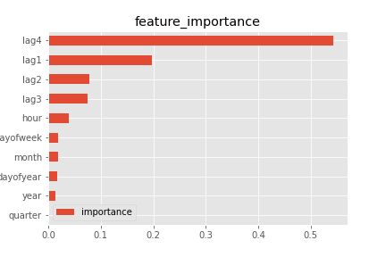
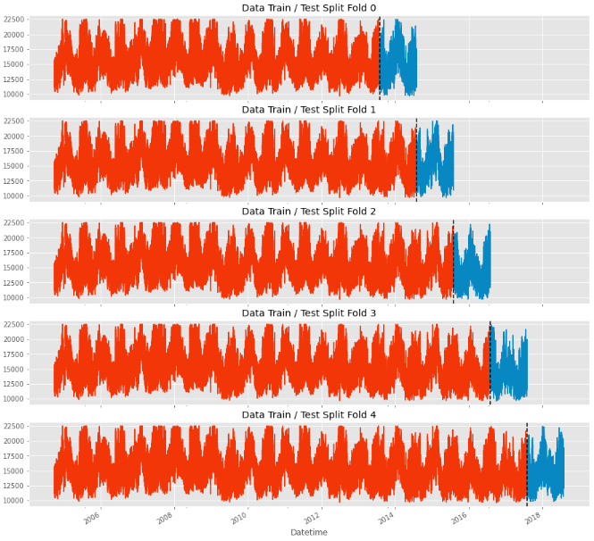
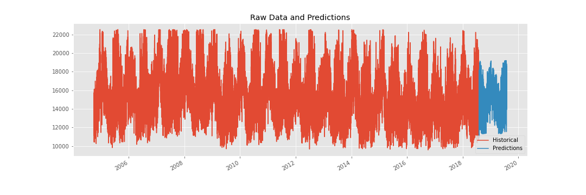

# Energy Consumption Forecasting

# Introduction
The purpose of this repository is to practice skills and techniques for the analysis and forecasting of timeseries data.
The datasets used within chart the engergy consumption for several energy suppliers on the East Coast ofthe US from 2010 to 2018. The dataset comes in relatively clean with missing values being the only concern.

# Data

[Hourly Energy Consumption Data](https://www.kaggle.com/datasets/robikscube/hourly-energy-consumption)

# Contents:
## 1. Timeseries_forecasting_using_XGBoost_regressor

## 2. Forecasting_using_xgboost_advanced_methods
- Outlier Reduction
- Lag Feature Creation

    

- Cross Validation

    

- Forecasting
    

